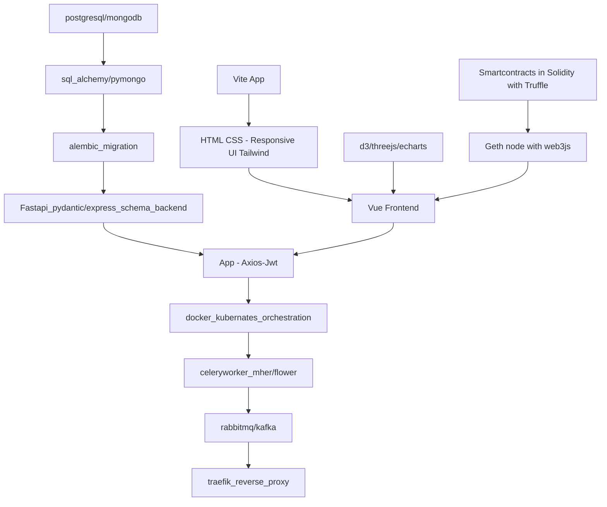
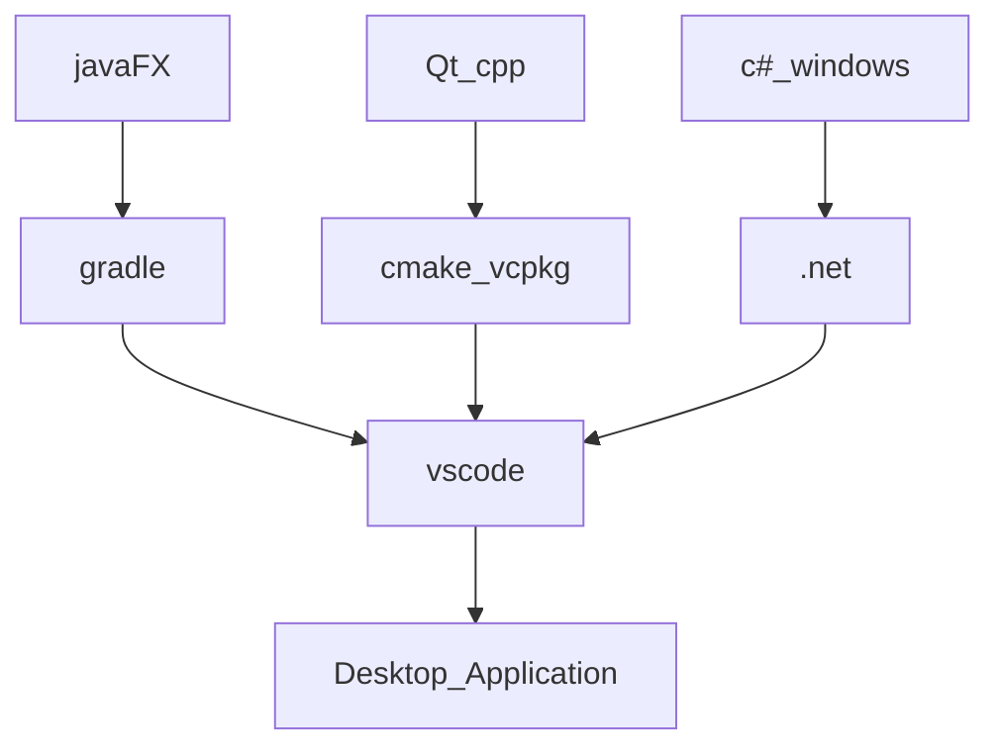
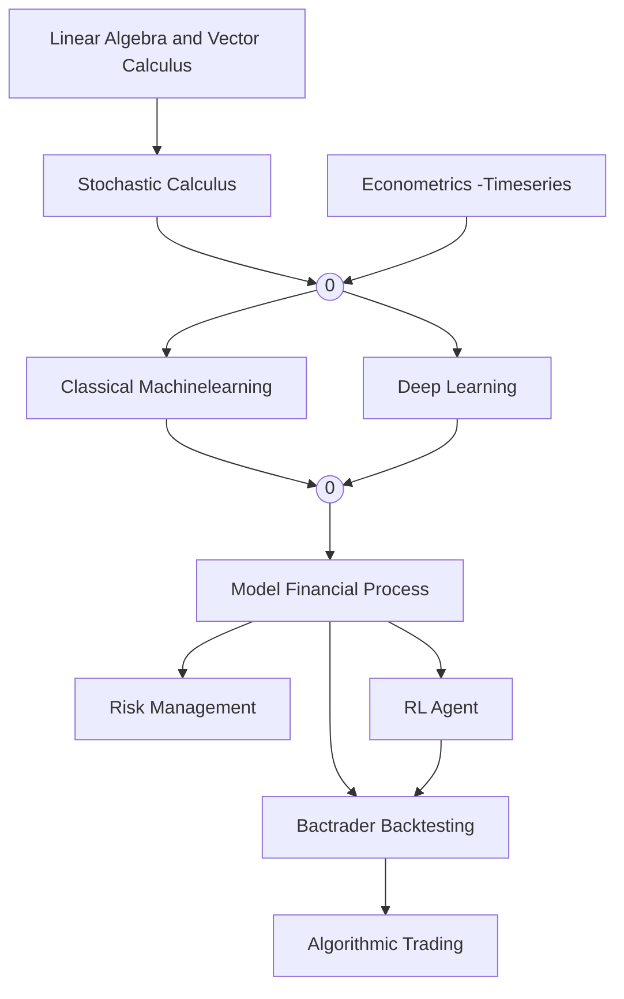

# Learning path

## Web Fullstack development

```mermaid
graph TD
    a[Vite App] --> b[HTML CSS - Responsive UI Tailwind]
    -->c[Vue Frontend];

    postgresql/mongodb --> sql_alchemy/pymongo 
    --> alembic_migration --> Fastapi_pydantic/express_schema_backend;  

    Fastapi_pydantic/express_schema_backend --> d[App - Axios-Jwt];

    c[Vue Frontend] --> d[App - Axios-Jwt];

    d[App - Axios-Jwt] --> docker_kubernates_orchestration
    --> celeryworker_mher/flower --> rabbitmq/kafka 
    --> traefik_reverse_proxy;

    d3/threejs/echarts-->c[Vue Frontend];

    e[Smartcontracts in Solidity with Truffle] --> f[Geth node with web3js] --> c[Vue Frontend];


```

## Desktop Application

```mermaid
graph TD;
    javaFX-->gradle --> vscode;
    Qt_cpp--> cmake_vcpkg --> vscode;
    c#_windows--> .net --> vscode;
    vscode --> Desktop_Application
```

## Quantitative Finance

```mermaid
graph TD;
    a[Stochastic Calculus] --> p((0)) --> d[Classical Machinelearning];
     b[Model Financial Process] --> h[Bactrader Backtesting];

    d[Classical Machinelearning] --> z((0))-->b[Model Financial Process];

    b[Model Financial Process] --> j[Risk Management];

    e[Econometrics -Timeseries] --> p((0)) --> g[Deep Learning];
    g[Deep Learning] --> z((0));
    b[Model Financial Process] --> f[RL Agent] -->  h[Bactrader Backtesting];
    h[Bactrader Backtesting] --> c[Algorithmic Trading];
    i[Linear Algebra and Vector Calculus] --> a[Stochastic Calculus] ;

    


```